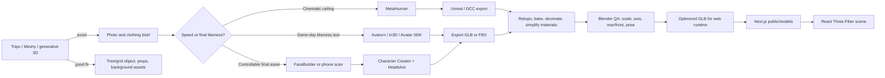

# Ryan Portfolio Avatar Pipeline Decision

## Recommendation

The previous procedural/stylized prototype proved that the site can load and orient a local GLB, but it is **not** an acceptable art direction for Ryan's likeness.

For the real avatar, prioritize a **photo/scan-to-digital-human pipeline**:

1. **Fastest credible likeness test:** Avaturn, in3D, or Avatar SDK -> selfie/photo capture -> export GLB/FBX -> Blender cleanup -> React Three Fiber.
2. **Best final character path:** KeenTools FaceBuilder or a phone scan -> Character Creator + Headshot -> custom clothes/materials -> FBX/GLB -> Blender optimization -> React Three Fiber.
3. **Highest-end cinematic path:** scan/mesh/video footage -> MetaHuman in Unreal Engine -> DCC export/optimization -> web GLB only if we can simplify it enough for the portfolio.

Ready Player Me and VRoid are no longer recommended for the target direction. They are useful only if Ryan intentionally pivots back to stylized/cartoon/anime.

Do **not** use Tripo as the main avatar source for a near-identical human likeness. Use it for the living tree, systems-grid objects, abstract props, and possibly clothing/blockout experiments where cleanup debt is acceptable.

## Why

- Likeness is now the hard requirement. Manual/procedural modeling can get colors and silhouette right, but it will not read as Ryan without a face/scan-driven base mesh.
- Avaturn/in3D/Avatar SDK are the fastest practical experiments because they start from selfies or phone capture and produce exportable avatars.
- FaceBuilder + Character Creator/Headshot is the strongest controllable final-art path because it combines photo-derived likeness, realistic body/clothing tooling, and game/web export formats.
- MetaHuman is the highest visual ceiling, but it starts in Unreal Engine and must be aggressively optimized or translated before it belongs in a lightweight web portfolio.
- Google's current relevant work is better treated as research/reference or live face-tracking support, not as the main exportable asset pipeline for this site.
- Blender remains the practical cleanup and export checkpoint for final scale, origin, forward axis, material simplification, idle pose, and optional animation testing.
- React Three Fiber is the best integration layer for this Next site because it keeps the avatar in the React component model while still using Three.js GLTF loading.
- Spline is useful for art-direction mockups or simple authored scene objects, but it should not be the main runtime dependency for a character pipeline unless Ryan wants to manage the whole 3D scene in Spline.

## Pipeline

## Asset Checklist

- Silhouette: relaxed technical/founder posture, calm premium consumer-product tone, not gamey, not goofy.
- Clothing: Rhythm James Jacket reference in Oak/tan cotton canvas with classic fit, contrast collar, subtle workwear shape, and metal zipper; AETHER Fairfax Pant reference in Onyx Black with garment-dyed stretch twill, classic fit, slight taper, and restrained cargo/utility detail.
- Identity: use real photos or phone scan as the source of truth for face/head likeness; manual/no-photo is backup only for silhouette exploration.
- Pose: neutral relaxed A-pose or softened idle pose, arms not locked in T-pose for production.
- Orientation: export with known forward axis; confirm home = rear-facing and profile = front-facing in browser.
- Materials: matte fabric, limited metallic accents, no glossy plastic skin, no noisy decals.
- Runtime format: standardize production runtime on optimized `.glb`; keep `.blend` and vendor source files; use `.fbx` for Character Creator/Mixamo/Blender interchange; use `.vrm` only if the chosen service exports a good VRM.
- Performance: target under 10 MB initial GLB if possible, under 20 MB maximum for the hero/profile avatar; merge/atlas textures and compress with Meshopt/KTX2 where reasonable.
- Legal/source: save the source project, export license notes, and final GLB in an asset folder with provenance.

## Photo-Assisted Creation Notes

- Use the photo only to get head/face proportions into the right neighborhood.
- After generation, manually set the wardrobe: Oak/tan canvas jacket, black classic-fit pants, neutral shirt, dark shoes.
- Avoid overfitting to the photo; the portfolio character should read as an owned stylized avatar, not a scanned likeness.
- Save both the avatar URL and a downloaded `.glb` if the creator exposes download.
- If photo upload or login is required, Ryan should handle that directly in the browser.

## First Asset Prompt

Create a realistic full-body digital double of Ryan for a premium technical portfolio site. Use Ryan's provided front/three-quarter/profile photos or phone scan as the source of truth for likeness: head shape, hairline, facial proportions, eye spacing, nose, jaw, stubble, and overall expression. Do not make a generic handsome avatar and do not stylize into cartoon/anime. Wardrobe: tan/Oak canvas workwear jacket inspired by the Rhythm Men's James Jacket, classic fit, contrast collar, metal zipper detail, no visible brand marks; black pants inspired by the AETHER Fairfax Pant in Onyx Black, garment-dyed stretch twill, classic fit, slight taper, restrained right-leg cargo/utility detail; neutral shirt; dark minimal shoes. Body language: relaxed standing pose, shoulders calm, head level, not heroic, not goofy. Output should support a rear-facing homepage pose and a front-facing profile pose. Export a rigged full-body FBX/GLB with clean topology, named materials, texture maps, neutral pose, and a known forward-facing axis.

## Clothing References

- Jacket: Rhythm Men's James Jacket, color Oak. Visual targets: tan/Oak cotton canvas, classic fit, contrast collar, metal zipper, subtle workwear durability.
- Pants: AETHER Fairfax Pant, color Onyx Black. Visual targets: black garment-dyed stretch twill, classic fit, slight taper, topstitching, restrained cargo pocket on wearer's right leg.

## Local Spike

Prototype route: `/avatar-spike`

Current rejected placeholder: `public/models/ryan-avatar.glb`, generated by `scripts/generate-ryan-avatar.py` and saved from Blender as `assets/avatar/source/ryan-avatar.blend`.

What it validates:

- A local GLB can be served from `public/models`.
- R3F can render inside the existing Next app.
- The same avatar scene can switch between a homepage rear view and a profile-facing view.
- Procedural tree/grid geometry can coexist with the avatar without needing a separate modeling tool.

What it does **not** validate:

- Likeness.
- Final character quality.
- Clothing realism beyond rough color/silhouette.

Fallback fixture: `public/models/Xbot.glb`, downloaded from the official three.js examples. This is only a loader fallback, not art direction.
